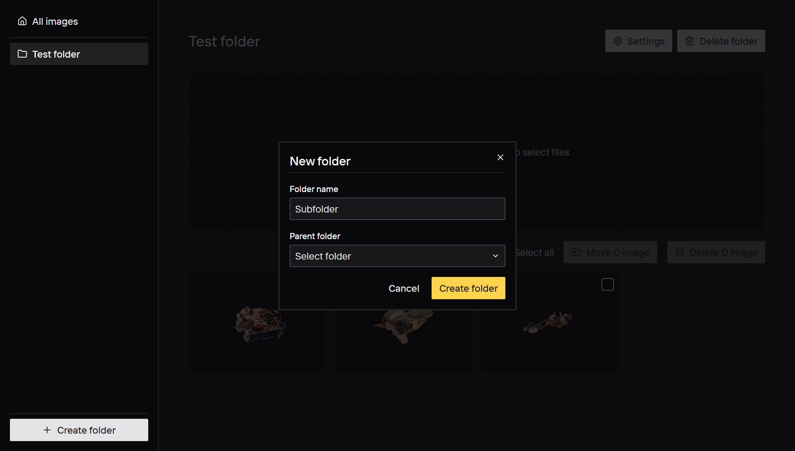
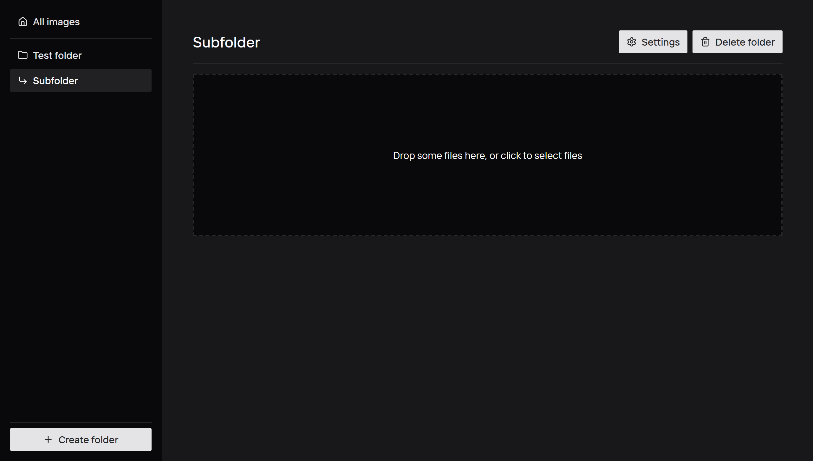
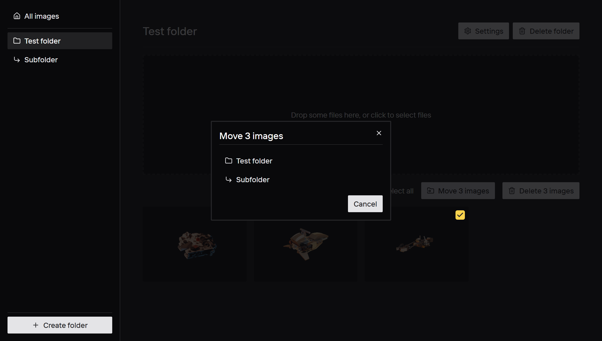

# Nested folders

- [ ] Make it possible to select a parent folder in the `FolderForm` modal.
  - [ ] Delete sub-folders when deleting a folder. Images in sub-folders should be deleted too.
  - [ ] Update `SideNav` to make the folders hierarchy visible.
  - [ ] Write an e2e test asserting the folder hierarchy is correctly displayed.
- [ ] Create a select component using [Radix Select primitive](https://www.radix-ui.com/primitives/docs/components/select).
  - [ ] Write a Storybook story for it.

## Bonus

- [ ] Make it infinitely nestable.
  - [ ] Make sure the hierarchy is correctly displayed in the `Select` of the `FolderForm` modal.
- [ ] Update `MoveImages` modal to make the folders hierarchy visible.

## Nested folders form

## Nested folders hierarchy

