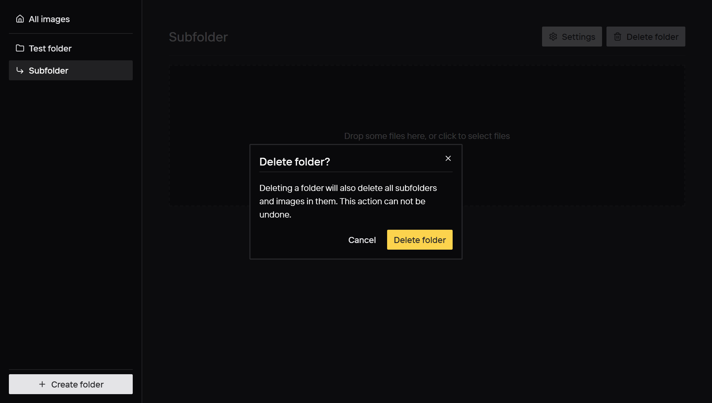
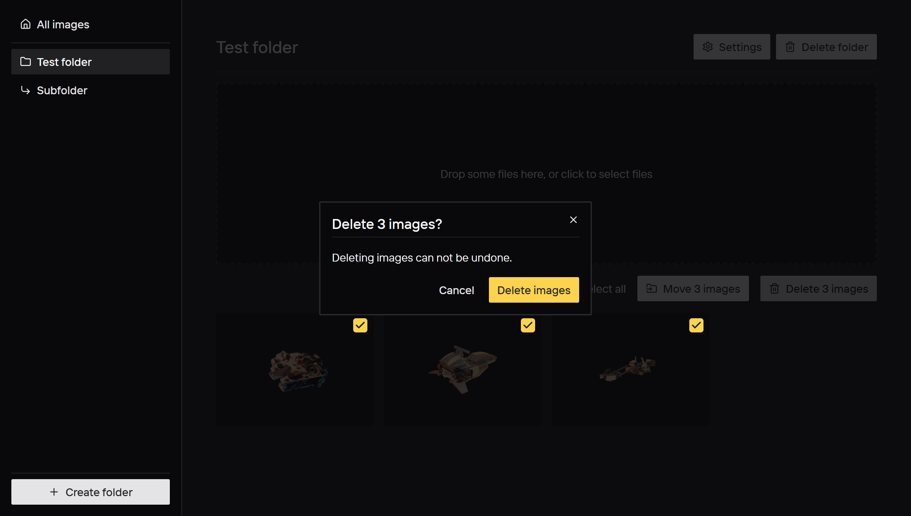

# Persistence

- [ ] Use browser storage to make images and folder persistent when refreshing the page.
  - [ ] Write e2e tests asserting the images and folders are persistent when the page is refreshed.
- [ ] Add a confirm modal when deleting a folder.
  - [ ] Update the delete folder e2e test to pass.
- [ ] Delete the images when deleting a folder.
  - [ ] Write an e2e test asserting images are indeed deleted with their folder.
- [ ] Add a button to delete selected images with a confirm modal.
  - [ ] Write an e2e test asserting selected images are indeed deleted.

## Delete folder confirm modal

## Delete images confirm modal

