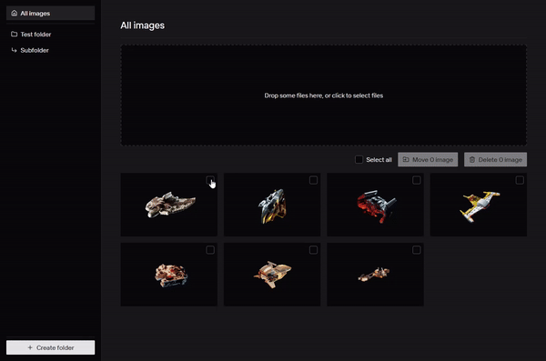

# Range selection

- [ ] Users can select a range of images by holding `SHIFT` after checking an image.

## Bonus

- [ ] Users can deselect a range by holding `SHIFT` after unchecking an image.
- [ ] Users can toggle multiple ranges at once (i.e. select 1,2,3 then 5,6,7 for example).

## Range selection demo

